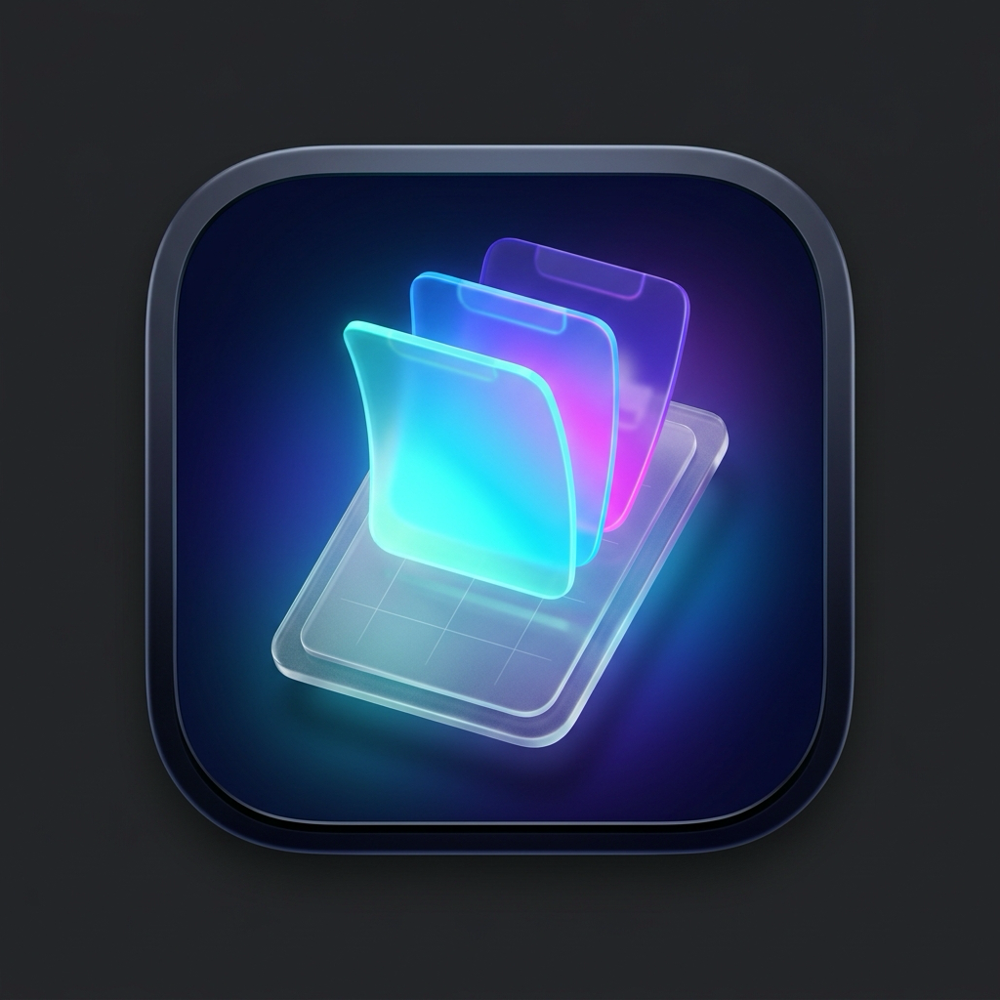

# 📋 Win+V for Mac

<p align="center">
  
</p>

<p align="center">
  <b>Recreate the native Windows + V clipboard history experience on macOS.</b><br>
  Built with Swift 6 & SwiftUI. Lightweight, cursor-following, instant search, and zero-latency auto-paste.
</p>

<p align="center">
  <a href="https://github.com/carloseorsantos/win-v-for-mac/releases/latest/download/WinPlusV-macOS.dmg">
    
  </a>
</p>

<p align="center">
  <a href="README.md"></a>
  <a href="README.pt-BR.md"></a>
  <a href="https://github.com/carloseorsantos/win-v-for-mac/releases/latest"></a>
  
  
  
</p>

---

<p align="center">
  <b>🇺🇸 English Documentation</b> • 
  <a href="README.pt-BR.md"><b>🇧🇷 Leia em Português</b></a>
</p>

---

## ✨ Key Features

- **Global Cursor Popup (`⌥ + V` / Option + V):** Floating history panel appears right adjacent to your mouse cursor without moving your workflow context.
- **Smart Auto-Paste:** Selecting any item (click, `Enter`, or number keys `1-9`) instantly hides the popup and pastes into your focused application.
- **Multi-Type Content Support:**
  - **Formatted Text & Code:** Multi-line preview, character and line counts.
  - **Images:** High-res thumbnail previews for copied screenshots and images.
  - **Hex Color Codes (`#HEX`):** Automatic detection with real-time color swatch preview.
  - **Links & URLs:** Smart URL parsing with domain badges.
- **Automatic Screenshot Ingestion:** Automatically monitors macOS screen captures (saved files via Cmd+Shift+3/4 or copied via Cmd+Ctrl+Shift+4) and adds them directly to your history, with quick "Show in Finder" and 1-click paste.
- **Pin Items (Favorites 📌):** Pin frequently used snippets so they are never deleted from history.
- **Instant Search:** Real-time search with category tabs (*All, Pinned, Screenshots, Text, Images, Links, Colors*).
- **Non-Activating HUD Design:** Uses native macOS vibrancy / blur and doesn't steal window key focus.
- **Menu Bar Companion (`MenuBarExtra`):** Lives in the menu bar with zero Dock clutter (`LSUIElement`).
- **Launch at Login:** Native option in Preferences to start Win+V in the background on system startup (`SMAppService`).
- **Local Persistence & Privacy:** Stored safely on-device in `~/Library/Application Support/WinPlusV/` with configurable history limits.

---

## ⌨️ Keyboard Shortcuts

| Shortcut | Action |
| :--- | :--- |
| **`⌥ + V`** (*Option + V*) | Open / Close clipboard history at mouse cursor |
| **`1` to `9`** | Instantly paste item 1–9 |
| **`↑` / `↓`** | Navigate list items |
| **`⏎` (*Enter*)** | Paste selected item |
| **`Esc`** | Dismiss window |

---

## 🚀 Installation & Setup

### Option 1: Direct DMG Download (Recommended for Users)

Get started with zero configuration or developer tools required:

1. **[Download the latest `WinPlusV-macOS.dmg`](https://github.com/carloseorsantos/win-v-for-mac/releases/latest/download/WinPlusV-macOS.dmg)**
2. Double-click the downloaded `.dmg` file to open it.
3. Drag **WinPlusV** to your **Applications** folder.
4. Launch **WinPlusV** from `/Applications` or Spotlight (`⌘ + Space`).

> [!TIP]
> On first launch, macOS may prompt to verify the open-source application. If needed, right-click (or Control-click) `WinPlusV.app` in `/Applications` and select **Open**.

---

### Option 2: Build & Install from Source (For Developers)

You can build, sign ad-hoc, and install directly from the repository using the automated scripts:

```bash
# 1. Clone repository
git clone https://github.com/carloseorsantos/win-v-for-mac.git
cd win-v-for-mac

# 2. Compile, sign, and install to /Applications in 1 click
./Scripts/install.sh
```

#### Other Useful Developer Scripts

- **Build `.app` Bundle and `.zip`:**
  ```bash
  ./Scripts/build.sh
  ```
- **Generate `.dmg` Installer locally:**
  ```bash
  ./Scripts/create_dmg.sh
  ```
- **Run Unit Tests:**
  ```bash
  swift test
  ```
- **Run in Development Mode:**
  ```bash
  swift run WinPlusV
  ```
- **Automated Release Creation:**
  ```bash
  ./Scripts/release.sh 1.1.0 "Release description"
  ```

---

## 🔒 Accessibility Permission (For Auto-Paste)

For Win+V to simulate the `⌘ + V` keystroke into other apps, macOS requires Accessibility permission:

1. Open **System Settings** > **Privacy & Security** > **Accessibility**.
2. If `WinPlusV` is already listed from an older build, select it and click **`-` (Minus)** to remove it.
3. Click **`+` (Plus)**, navigate to `/Applications/WinPlusV.app`, and enable the toggle.
4. You can verify permission status anytime under **Menu Bar Icon > Preferences > Accessibility** (shows green shield icon ✅).

---

## 🏛️ Architecture & Tech Stack

```
Sources/WinPlusV/
├── App/
│   ├── WinPlusVApp.swift          # Main entrypoint with MenuBarExtra and Settings Scene
│   └── AppDelegate.swift          # AppKit lifecycle, window initialization & cleanup
├── Core/
│   ├── ClipboardMonitor.swift     # NSPasteboard observer & deduplication engine
│   ├── HotKeyManager.swift        # Global Option+V hotkey via Carbon Event API
│   ├── PasteService.swift         # Hardware-level key simulation (CGEvent / cghidEventTap)
│   ├── FloatingPanelController.swift # Non-activating NSPanel with vibrancy & mouse anchoring
│   └── StorageManager.swift       # Disk persistence (JSON), pinning & history pruning
├── Models/
│   ├── ClipboardItem.swift        # Model supporting Text, Images, Colors, URLs and Pins
│   └── AppSettings.swift          # UserDefaults preferences (auto-paste, history limits)
├── Views/
│   ├── ClipboardPopupView.swift   # Main floating popup interface with search & tabs
│   ├── ClipboardItemRow.swift     # List item row view with shortcuts and actions
│   ├── SettingsView.swift         # Preferences window (General, Accessibility, About)
│   └── MenuBarView.swift          # MenuBarExtra status item menu
└── Utilities/
    ├── AppInfo.swift              # App versioning and bundle constants
    ├── CursorPositionHelper.swift # Screen-aware mouse coordinate calculation
    └── ColorExtractor.swift       # Hex color regex validator and SwiftUI color builder
```

---

## 🤝 Contributing

Contributions are very welcome! Please check out [CONTRIBUTING.md](CONTRIBUTING.md) for guidelines on submitting issues and pull requests.

---

## 📄 License

This project is licensed under the [MIT License](LICENSE).
